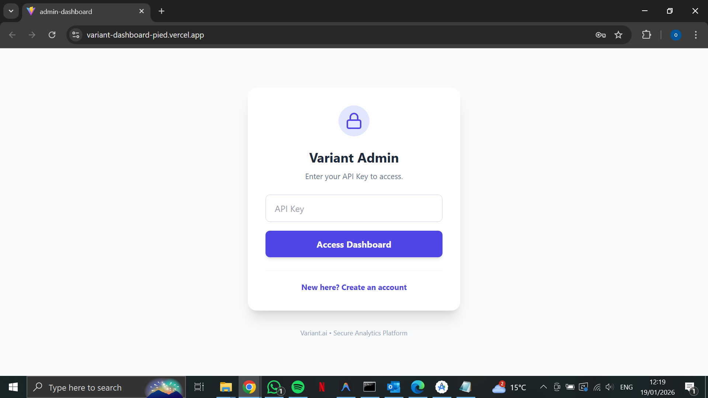
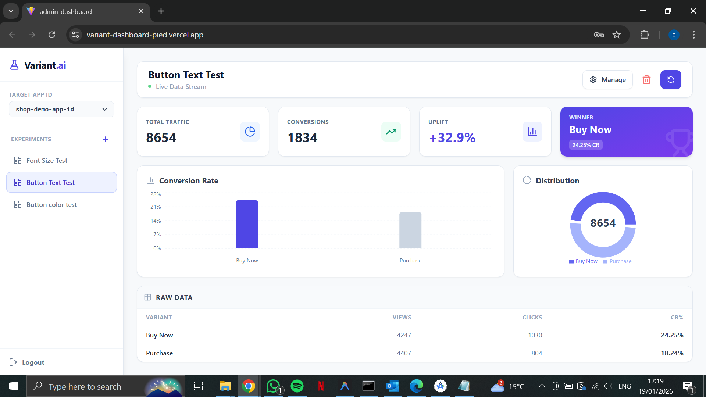
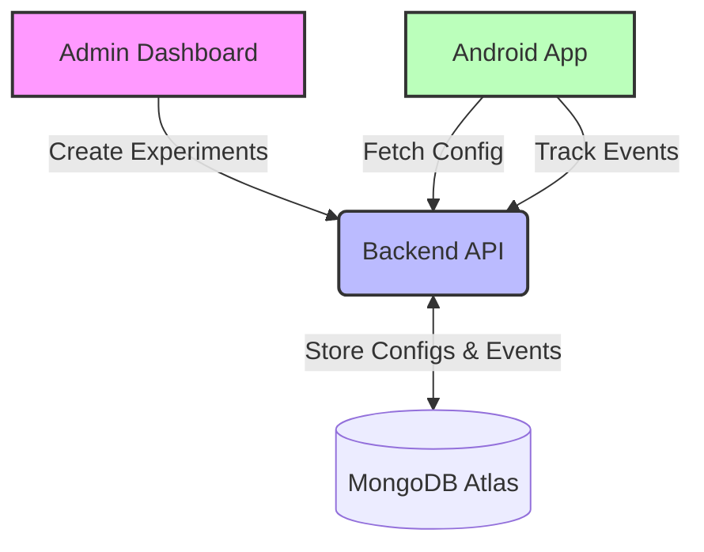

# Variant - Mobile A/B Testing Platform 🧪

[](https://jitpack.io/#Orimmrko/variant-sdk)
[](LICENSE)
[](https://developer.android.com)

**Variant** is a lightweight, open-source A/B testing framework for Android. It allows developers to remotely configure UI elements, run experiments, and analyze user behavior in real-time through a dedicated dashboard.

---

## 🚀 Live Demo

You can try the administration dashboard right now without installing anything!

* **Dashboard URL:** [https://variant-dashboard-pied.vercel.app](https://variant-dashboard-pied.vercel.app/)
* **Backend API:** [https://variant-backend-lfoa.onrender.com](https://variant-backend-lfoa.onrender.com)

### 🔑 Guest Access Credentials
Use this key to access the dashboard in read-only mode (Guest App):
> **API Key:** `guest-key-456`

---

## 📸 Screenshots

See the platform in action. The dashboard allows you to manage experiments and view real-time analytics.

| Experiment Management | Real-Time Analytics |
|:---:|:---:|
|  |  |

> *Note: Screenshots demonstrate the admin portal capabilities.*

---

## 🛠 Architecture

Variant is built with a microservices approach, separating the management logic from the client SDK.



### Components
1.  **Android SDK:** A Kotlin library hosted on JitPack for easy integration.
2.  **Backend Service:** A Python (Flask) API handling configuration delivery and event tracking.
3.  **Admin Dashboard:** A React-based portal for managing experiments and viewing analytics.

---

## 📦 Installation

Add the JitPack repository to your build file.

**Step 1.** Add it in your root `settings.gradle.kts` (or `build.gradle`):
```kotlin
dependencyResolutionManagement {
    repositories {
        google()
        mavenCentral()
        maven { url = uri("https://jitpack.io") } // Add this line
    }
}
```

**Step 2.** Add the dependency in your module's `build.gradle.kts`:
```kotlin
dependencies {
    implementation("com.github.Orimmrko:variant-sdk:v1.0.3")
}
```

---

## ⚡ Quick Start & Usage

### 1. Initialization
You must initialize the SDK before accessing any variables. The best place to do this is in your `Application` class.

```kotlin
import io.variant.android.core.Variant

class MyApplication : Application() {
    override fun onCreate() {
        super.onCreate()
        // Initialize with Context, API Key, and App ID
        Variant.init(
            context = this, 
            apiKey = "YOUR_SECRET_KEY", 
            appId = "YOUR_APP_ID"
        )
    }
}
```

### 2. Fetching Variables
The SDK provides type-safe methods to retrieve configuration values. All methods require a **fallback value**.

**Get Strings & Colors:**
```kotlin
// Get a color (e.g., for A/B testing button colors)
val btnColor = Variant.getString("btn_color", "#0000FF") // Default: Blue

// Get a text string
val ctaText = Variant.getString("cta_text", "Buy Now")
```

**Get Numbers:**
```kotlin
// Values are stored as strings, parse them as needed
val fontSizeStr = Variant.getString("font_size", "14")
val fontSize = fontSizeStr.toIntOrNull() ?: 14
```

### 3. Event Tracking
The SDK automatically tracks **exposure events** (views) when you initialize it and fetch configs. This ensures that every user who sees an experiment is counted in the analytics.

---

## 🔌 API Reference

The Android SDK communicates with the backend via the following REST endpoints.

**Base URL:** `https://variant-backend-lfoa.onrender.com`

### 1. Get Configuration
* **URL:** `/api/config`
* **Method:** `GET`
* **Response:** ````[ { "experimentId": "...", "key": "btn_color", "value": "red" } ]````

### 2. Track Event
* **URL:** `/api/track`
* **Method:** `POST`
* **Body:** ````{ "userId": "...", "experimentId": "...", "variantName": "...", "event": "exposure" }````

---

## ❓ Troubleshooting

**Q: I only see the default values.**
A: Check the following:
1.  Is your internet connection active?
2.  Did you enter the correct `appId` and `apiKey`?
3.  Is the experiment status set to "Active" in the dashboard?

---

## 📄 License

This project is licensed under the MIT License - see the [LICENSE](LICENSE) file for details.